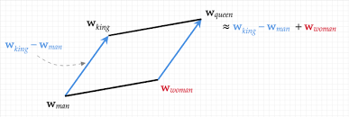
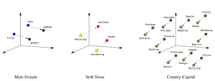
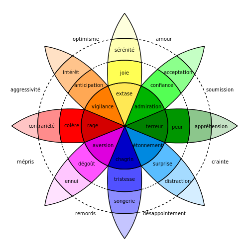
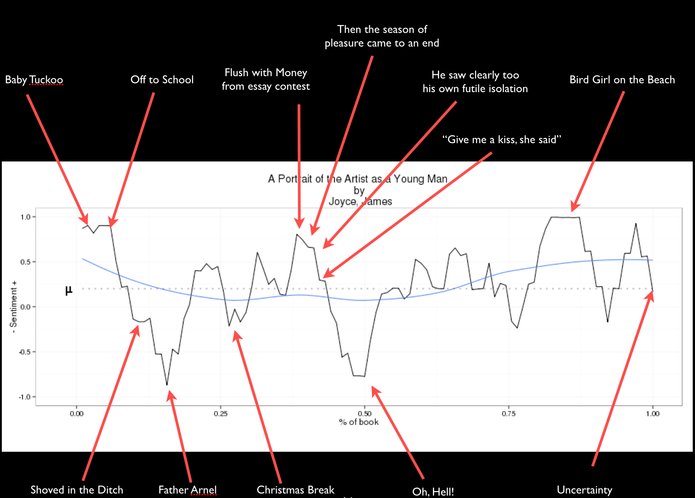
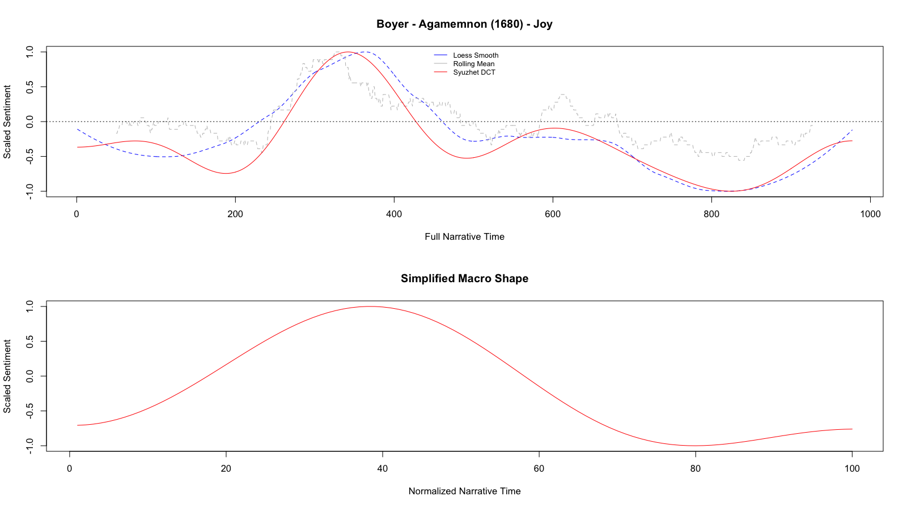

Cours DH UniGE

# L'analyse de sentiment

Simon Gabay
Genève, Mardi 19 mai 2020

---
# Introduction

---
## _Big data_

On parle aujourd'hui de _big data_

* Une situation: les réseaux sociaux, les mails, etc.
* Un problème: comment "savoir ce qu'il s'y dit"
* Une opportunité: développer des modèles prédictifs?

---
## _Opinion mining_

Ce que nous appelons analyse de sentiment (_sentiment analysis_) n'est qu'une version de l'_opinion mining_
* Comment savoir, à partir de 10 000 mails, ce que mes clients me disent?
* Puis-je savoir quelle est ma réputation en ligne?
* Suis-je capable de prédire des choses plus complexes, comme l'apparition d'une épidémie? une modification du cours de bourse?

Il existe donc des applications financières, médicales… avant d'être littéraires ou historiques.

---
## Le principe

L'hypothèse de travail est qu'il existe une différence entre ces deux phrases:

* Mais voilà une **excellente** nouvelle. Je suis **vraiment très très heureux** pour toi de ce **succès**
* Tu me vois **désolé** d'apprendre cette **si triste** nouvelle. La situation est **dramatique**: cela doit vraiment être **difficile** pour lui.

Par la simple observation des occurrences des mots et la constitution de champs lexicaux, nous devrions être capable de saisir la substance d'un énoncé

---
## Les limites de cette approche

Comment analyser cette phrase?

> Une preuve que les nègres n'ont pas le sens commun, c'est qu'ils font plus de cas d'un collier de verre que de l'or, qui, chez les nations policées, est d'une si grande conséquence.
> Montesquieu, _De l'Esprit des lois_, XV, 5

La phrase aurait-elle le même sens dans les œuvres complètes d'Adolphe Hitler et dans celles de Pierre Desproges?

---
# Approche technique

---
## Fonctionnement

Le système le plus simple est l'approche à base de lexique (_lexicon based_). L'idée de créer (ou récupérer) une liste des mots qui nous intéressent et ainsi
qui permette d'analyser une phrase.
1. On lemmatise
2. On sélectionne les mots thématiques (on retire les mots vides)
3. On assigne une valeur positive ou négative à chaque token
4. On peut même essayer d'assigner une valeur

---
## Un exemple

| Token     | Lemme   | Sélection | Score | Score 2 |
|-----------|---------|-----------|-------|---------|
| Sissi     | Sissi   | Fonction  |       |         |
| ,         | ,       | Fonction  |       |         |
| cette     | ce      | Fonction  |       |         |
| grande    | grand   | grand     | +     | 1.1     |
| princesse | prince  | prince    |       |         |
| ,         | ,       | Fonction  |       |         |
| est       | être    | Fonction  |       |         |
| heureuse  | heureux | heureux   | +     | 3.2     |
|.          | .       | Fonction  |       |         |

---
## Les scores

Deux approches
* La connotation positive ou négative d'un mot s'appelle la _polarité_
* Le degré de positivité ou de négativité s'appelle _l'intensité_ (ou _valence_, dans son acception psyhologique et non syntaxique)

|                | Polarité | Intensité |
|----------------|----------|-----------|
| correct        | Positive | 1         |
| bien           | Positive | 2         |
| super          | Positive | 3         |
| extraordinaire | Positive | 4         |

La question de l'échelle pour mesurer la valence n'est pas simple: sur 4

---
## Subjectivité

La question des sentiments est sujette à des modifications très rapides, avec de nombreuses innovations qui permettent de mieux interpréter les scores obtenus. On peut ainsi rajouter la question de la subjectivité.

|                        | Polarité | Subjectivité |
|------------------------|----------|--------------|
| Ce film est magnifique | +        | ∅            |
| J'adore ce film        | +        | +            |
| Je regarde ce film     | ∅        | +            |

Cela permet de connaître le sentiment des gens de manière plus précise, mais aussi de ne pas surinterpréter des données peu objectives.

---
## Le rapport entre les mots

Comment peut-on mesurer la valence d'un mot? Pourquoi _heureux_ a-t-il une valeur de 8.21, _bien_ de 7.47, et _triste_ de _1.61_?
* Enquête auprès de locuteurs
* Récupération de corpus (contenu de tous ceux avec l'emoji _:-)_ vs tous ceux avec l'emoji _:-(_  )
* Création à partir de "plongements lexicaux" (_word embeddings_), c'est à dire une représentation lexicale au moyens de vecteurs de nombres réels.

On parle de l'hypothèse (distributionnelle) de Harris: les mots sémantiquement proches sont syntaxiquement proches – d'où l'importance de correctement calibrer le corpus d'entraînement.

---
## Le vecteur

Prenons deux phrases:
* Il aime Jeannette
* Elle aime Raoul

Un premier type de vecteur (dit _one hot encoding_), le plus simple, est tout simplement la liste des mots d'un tokens possibles

|           | il | aime | Jeannette | elle | Raoul |
|-----------|----|------|-----------|------|-------|
| il        | 1  | 0    | 0         | 0    | 0     |
| aime      | 0  | 1    | 0         | 0    | 0     |
| Jeannette | 0  | 0    | 1         | 0    | 0     |

* il -> `[1 0 0 0 0]`
* aime -> `[0 1 0 0 0]`

---
## _index-based encoding_

Il est possible de simplifier ce système avec des _index-based encoding_, qui assigne comme valeur à chaque mot sa position dans le lexique

| Lexique   | Clef |
|-----------|------|
| il        | 1    |
| aime      | 2    |
| Jeannette | 3    |
| elle      | 4    |
| Raoul     | 5    |

* Il aime Jeannette -> `[1 2 3]`
* Elle aime Raoul -> `[4 2 5]`

---
## _Word embeddings_

Le problème avec les valeurs de l'index, c'est qu'elles sont arbitraires: _il_ (`1`) et _elle_ (`4`) ont des valeurs moins proches qu'_il_ (`1`) et _aime_ (`2`).

Avec de la sémantique distributionnelle, il est possible d'évaluer la proximité des mots à partir des fréquences de collocation, et donc de proposer des vecteurs moins grands que les _one hot_ (il -> `[1 0 0 0 0]`) et donc des valeurs moins arbitraires. Les _word embeddings_ (ou "plongement lexical") reprennent et améliorent cette idée.

| Lexique   | Clef |
|-----------|------|
| il        | 0.12 |
| aime      | 0.23 |
| Jeannette | 0.76 |
| elle      | 0.13 |
| Raoul     | 0.66 |

---
## Représentation graphique

Il est possible de représenter visuellement les données à partir des vecteurs, car ce sont des valeurs numériques. Cette spatialisation du lexique doit permettre de rendre compte de la relation entre les mots.

Source: [https://www.ed.ac.uk/](https://www.ed.ac.uk/informatics/news-events/stories/2019/king-man-woman-queen-the-hidden-algebraic-struct)

---

Source: [https://www.ed.ac.uk/](https://towardsdatascience.com/the-magic-behind-embedding-models-c3af62f71fb)

---
## Champ lexical

Il est donc possible de reconstituer des champs lexicaux informatiquement, à partir de ces valeurs. Par exemple, à partir des chroniques de Berlioz dans le Journal des débats entre 1834 et 1861.

| Token      | Value              |
|------------|--------------------|
| Beethove   | 0.7579751014709473 |
| Weber      | 0.7569864988327026 |
| Haydn      | 0.7024569511413574 |
| Freyschütz |0.6202365159988403  |
| Symphonie  | 0.584333062171936  |

Source: [https://scoms.hypotheses.org](https://scoms.hypotheses.org/657)

---
# Les huit émotions

Robert Plutchik (1927-2006), psychologue, a développé une méthode de classification des réactions émotives générales. Cette théorie est souvent représentée par la _Roue des émotions de Plutchik_.

Il y aurait huit émotions de base : la joie, la peur, le dégoût, la colère, la tristesse, la surprise, la confiance et l'anticipation.

Chacune d'elles déclenche un comportement d'une grande valeur de survivance ; par exemple, la peur inspire la réaction de fuite ou de combat, la colère inspire la défense de ses acquis (dont la femelle), la tristesse implique le repos essentiel pour l'auto-préservation de l'organisme, et la joie implique la recherche de ressources.

---

Source: [Wikipedia](https://commons.wikimedia.org/wiki/File:Plutchik-wheel_fr.svg?uselang=fr)

---
# Exemple de lexique français

| word  | pol. | joy | fear | sadness | anger | surprise | disgust |
|-------|------|-----|------|---------|-------|----------|---------|
| joie  | pos. | 1   | 0    | 0       | 0     | 0        | 0       |
| peur  | neg. | 0   | 1    | 0       | 1     | 1        | 0       |
| magie | pos. | 0   | 0    | 0       | 0     | 1        | 0       |

Amine Abdaoui, Jérôme Azé, Sandra Bringay et Pascal Poncelet. "FEEL: French Expanded Emotion Lexicon." _Language Resources and Evaluation, LRE 2016_, pp 1-23. http://advanse.lirmm.fr/feel.php

---
## Note

Attention, il existe une multitude de lexiques, tous différents.Allez les regarder.

* Bing
* Afinn
* Stanford
* NRC

---

# Application à la littérature

---
## Matthew L. Jockers

Professeur de littérature, ex bras droit de Fr. Mortti, est le développeur du package _Syuzhet_ pour l'analyse de sentiment. _Syuzhet_ est une méthode un peu rustre, mais relativement efficace:

---

Joyce, _A Portrait of the Artist as a Young Man_

---

Joyce, _A Portrait of the Artist as a Young Man_

---

Boyer, _Agamemnon_

---

* _Loess smooth_ (régression loess) permet de produire des courbes lissées, ajustées à un nuage de point
* _Syuzhet DCT_ (discrete cosine transformation) permet de réduire les arctefacts
* _Rolling mean_ (moyenne mobile) est moyenne constamment recalculée
